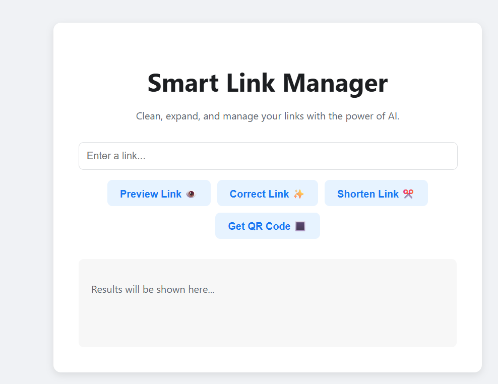

# 🔗 Smart Link Manager

An intelligent, all-in-one tool to **correct, preview, shorten, and generate QR codes** for your links — powered by **AI**.  

This full-stack application ensures a seamless user experience for managing URLs, with a unique **AI-powered feature to fix broken or mistyped links**.

---

## ✨ Live Demo  
- 🌐 **Frontend (Vercel):** [smart-link-manager.vercel.app](https://smart-link-manager.vercel.app/)  
- ⚡ **Backend API Docs (Hugging Face):** [userusman123-smart-link-api.hf.space/docs](https://userusman123-smart-link-api.hf.space/docs)  

---

## 🚀 Features  

✅ **AI Link Correction** – Automatically fixes common typos and errors in URLs (e.g., `gogle.cm` → `google.com`).  
✅ **Link Preview** – Generates a rich preview card (title, description, preview image).  
✅ **URL Shortening** – Instantly shortens long URLs via **TinyURL**.  
✅ **QR Code Generation** – Creates a downloadable QR code for any link.  

---

## 📸 Screenshots  

_(Add your screenshots here by dragging & dropping into this README on GitHub)_  

---

## 🤔 What Makes This Different?  

Unlike many link tools that only shorten or generate QR codes, **Smart Link Manager** stands out with its **AI-powered correction**.  
🔹 Most tools fail when users enter incorrect URLs.  
🔹 This app uses **Google’s Gemini model** to understand intent and provide corrected, working links — saving time and reducing frustration.  

---

## 🛠️ Tech Stack  

### 🔹 Backend (`/backend`)  
- ⚡ **FastAPI (Python)** – High-performance API framework  
- 🤖 **Google Gemini API** – Core AI-powered link correction  
- 🕵️ **BeautifulSoup** – Extracts metadata for link previews  
- 🚀 **Deployment:** Hugging Face Spaces (Dockerfile-based)  

### 🔹 Frontend (`/frontend`)  
- ⚡ **SvelteKit** – Fast, component-based UI framework  
- 📝 **TypeScript** – Type safety + better developer experience  
- 🎨 **Plain CSS** – Clean & modern UI design  
- 🚀 **Deployment:** Vercel (CI/CD hosting)  

### 🔹 Dev Tools  
- 🖊️ **Editor:** VS Code  
- 🔧 **Version Control:** Git + GitHub  
- 💻 **Terminal:** Git Bash  
- 📦 **Package Manager:** npm  

---

## 🌟 Support This Project  

If you found **Smart Link Manager** useful or interesting:  
⭐ Please **star the repo** on GitHub — it helps a lot!  

---
